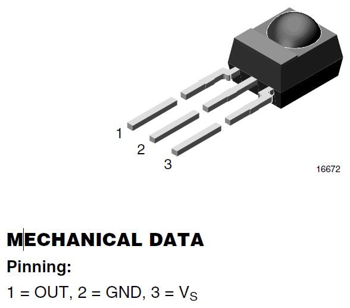

title = 'Lab 5 - Interrupts - "Remote Control Decoding"'

# Lab 5 - Interrupts - "Remote Control Decoding"

## Objectives

In this lab, you'll use your knowledge of interrupts and the Timer_A subsytem to reverse engineer a remote control.  

## Handy References
- Information on the [Sony SIRC Protocol](http://users.telenet.be/davshomepage/home.htm)
- You can verify your remote's button codes [here](http://lirc.sourceforge.net/remotes/)

## Given code
- [test5.c](test5.c) - Use this file to characterize the buttons of your remote
- [start5.c](start5.c) - Initial template file for lab
- [start5.h](start5.h) - Initial template file for lab

## Prelab

Read the assignment so you can make good use of your time in class.  You can also get a head start filling in the blank sections of code on test5.c.

## Details

### The Basic Idea

You will need to use the timer interrupt and the general purpose pin interrupt to decode a remote control.  Be sure to pick one remote for the whole lab, as remote codes vary.  

Lab day 1: learn the timing and bit patterns for your remote control
 
Lab day 2: demonstrate your code can receive and decode button presses from the remote control

Lab day 3: implement etch-a-sketch or pong

## Group Work Requirements
####If you are considering working on Lab 5 as a group here are the requirements:
- **Max Group size is 2**
- You must create a separate shared repo for the group to the shared repo named ECE382_LastName1_LastName2
- Each team member will place a link at the top of a readme in your personal repo in a Lab 5 folder
- Both partners must make contributions to the Lab and document contributions in commit messages
- Most likely you will have to switch your CCS workspace to a new folder to separate your repo from your private repo
- Don't forget to give you instructor access to the repo
- The expectation is that if you have twice the team members that you will have a better product
- Remember you **commit** to you own local copy of the repo, you **push** your to the cloud, and you **pull** the cloud copy to your local copy
- You may want to review merging and branching allow for better collaboration [merge a file](https://confluence.atlassian.com/bitbucket/use-a-git-branch-to-merge-a-file-681902555.html) or [git merge](https://git-scm.com/docs/git-merge)

### Lab day 1

The results of these activities should be posted to Bitbucket.

You will need to fill in the six blank lines of code in test5.c in the initMSP() suboutine.  This code will prepare the TimerA0 subsystem for use.

#### Connecting the IR sensor
Insert the IR receiver module into the protoboard.  Use M/F wires to connect your protoboard to your MSP430. Use a regular wire to connect your signal and ground to the logic analyzer.

When you are looking at the sensor ball on your IR receiver module, the pin on the left is your signal pin; the pin in the middle is your ground pin; and the pin on the right is your Vcc.  

On your MSP430, connect the signal pin to XIN/P2.6 on J2, the ground pin to the GND pin on J6, and the Vcc pin to Vcc on J6.  

#### Timer Counts
Build a project around your modified test5.c and then download it onto your LaunchPad. Make sure to open the variables tab (View -> Variables). I also like to clear memory from the Memory Browser tab (View -> Memory Browser), Fill Memory from 0x200 to 0x400 with 0's. Run the program and then press a button on a remote. Then pause the program and look at the variables. You should see something like the following.
  

 

A few questions about what goes on in this program are in order before we proceed.

1) How long will it take the timer to roll over?

2) How long does each timer count last?

The while(1) loop in main reads in the IR pulse in the for loop. 

Annotate the picture below to indicate which line of the for loop in the program is executed at which part of the pulse. You should show a total of 6 lines of code (lines 32-34 and lines 36-38).
 

 

#### IR data packets

Before you start on this portion of the assignment, watch [Dave Jones' Trigger Hold-off Tutorial](http://www.youtube.com/watch?v=ta096oBzSac). You are going to need to use the logic analyzer to examine the IR waveforms generated by a remote control of your choice. 

Set up your LaunchPad like the picture below. Make sure to connect the power and ground in the correct order! Connect the the logic analyzer on the Vout pin of the IR receiver.

 

 

 

Configure the logic analyzer to collect data on an edge change, with at least 90% of the data stored post-trigger.  On my remote control, the full remote control signal was about 80ms. Please note that remote control data packets are not standardized by any means, so the remote that you use to perform these experiment will almost certainly generate results different  from those that your neighbor's remote will generate.

List the lengths of the pulses generated by the remote control in absolute time using the logic analyzer (3 significant figures) and in timer A counts.  Note: "start -- logic 0 half pulse" refers to the logic LOW portion of the start pulse, and "data 0 -- logic 1 half pulse" refers to the second half (which is a logic HIGH) of the pulse representing a zero bit.

| Pulse | Duration (ms)	| Timer A counts |
| :-: | :-: | :-: |
| Start -- logic 0 half pulse | | |
| Start -- logic 1 half pulse | | | 	 
| Data 1 -- logic 0 half pulse | | | 	 
| Data 1 -- logic 1 half pulse | | |	 
| Data 0 -- logic 0 half pulse | | |	 
| Data 0 -- logic 1 half pulse | | |	 
| Stop -- logic 0 half pulse | | | 
| Stop -- logic 1 half pulse | | | |

Collect and tabulate in Excel eight samples of timer A counts for each of the following pulse types (in decimal). Compute the average and standard deviation of each pulse type. I would suggest just grabbing it from the CCS variables tab. 
 
- Data 1, logic 1 half-pulse

- Data 0, logic 0 half-pulse

- Data 0, logic 1 half-pulse

 
Ensure you label the rows and columns of your table so that I will know what the information in each cell means.

For each pulse type list the range of timer A counts that would correctly classify 99.9999426697% of the pulses. This number has something to do with the [standard deviation](http://en.wikipedia.org/wiki/Standard_deviation#Rules_for_normally_distributed_data) (hint: look at the table in this section).
 

Write the codes (in hex) for at least 10 remote control buttons.  ("Button name" refers to CH+, 6, VOL-, Power, etc.)

| Button | Button name | Hex code (not including start and stop bits) |
| :-: | :-: | :-: |
| 1 | | |	 
| 2 | | | 
| 3 | | |	 
| 4 | | | 
| 5 | | |	 
| 6 | | | 
| 7 | | | 
| 8 | | |
| 9 | | |
| 10 | | | |

### Day 2

Demonstrate to your instructor that your code can receive and decode button presses from the remote control.

### Required Functionality

Watch the [Dave Jones Trigger Hold-off](http://www.youtube.com/watch?v=ta096oBzSac) video and achieve that functionality using both timer interrupts and a port 2 interrupt.  Turn an LED on and off with one button on the remote.  Turn another LED on and off with a different button.  Turn both LEDs on and off with a third button.

In addition to the start.c and start.h files, the below image may be of some use: 
 

 

### A Functionality

Use the buttons on a remote control to either control your lab #4 etch-a-sketch (up, down, right, left, color) or your pong game.

## README

Don't forget to include your hardware schematic!  Software flowcharts and debugging information are also very useful.  Finally, you'll also want to document which remote control you used.

Be sure to include appropriate (not blurry or in need of rotation) screenshots, pictures, and tables.  Do not include anything handwritten without prior approval.  

Ensure you are committing regularly.

## Grading - Lab 5
[Printable Lab 5 Cutsheet](Lab_5_Cutsheet.pdf)

**Name:** 
 
**Section:**
 
 
**Documentation:** 
 

| Item | Grade | Points | Out of | Date | Due |
|:-: | :-: | :-: | :-: | :-: |
| Day 1 activities | **On-Time:** -------------------------------------------------------------------- **Late:** 1Day ---- 2Days ---- 3Days ---- 4+Days| | 20 | | BOC L29 |
| Required functionality | **On-Time:** -------------------------------------------------------------------- **Late:** 1Day ---- 2Days ---- 3Days ---- 4+Days| | 20 | | COB L30 |
| A Functionality | **On-Time:** -------------------------------------------------------------------- **Late:** 1Day ---- 2Days ---- 3Days ---- 4+Days| | 10 | | COB L30 |
| Code Style | **On-Time:** Zero ---- Check Minus ---- Check ---- Check Plus ---- **Late:** 1Day ---- 2Days ---- 3Days ---- 4+Days| | 15 | | COB L31 |
| README | **On-Time:** Zero ---- Check Minus ---- Check ---- Check Plus ---- **Late:** 1Day ---- 2Days ---- 3Days ---- 4+Days| | 30 | | COB L31 |
| Use of version control | **On-Time:** Zero ---- Check Minus ---- Check ---- Check Plus ----| | 5 | | COB L31 |
| **Total** | | | **100** | | | |
