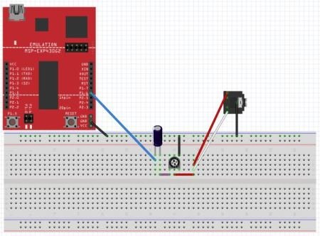

title = 'Interrupts and ISRs.  MSP430 Interrupt System.'

# Lesson 27 Notes

## Readings
- Barrett 3.1-3.5 (pp77-85)
- [Low Power Operation - Family Users Guide pp38-41](/382/datasheets/msp430_msp430x2xx_family_users_guide.pdf)
- [PPT Slides](Lsn27.pptx)

## Assignment
- Read [Lab 5](/382/labs/lab5/index.html)

## Lesson Outline
- Review Interrupts
- Low Power Modes
- [practice code](lec26.c)
- [lec27.c](lec27.c)
- [interruptTones.c](interruptTones.c)

## Review Interrupts

What did we talk about last time?  What's an interrupt?  What are the benefits of an interrupt?  What's stored in the Interrupt Vector Table?  What happens when an interrupt is triggered?

Remember what the programmer's job was in configuring interrupts - cover this again, emphasizing local / global switch.

Any questions?

Let's take a look back at the interrupt code I presented last lesson for toggling the Launchpad LED's on button push.  What am I not doing in my button handling code that could cause problems?  I'm not debouncing!  What are some ways I could handle that?

- I could wait for release in my ISR and debounce when I sense a release.
	- What's wrong with that?
- I could connect the button to two different pins and have one sense push, the other sense release.
	- What's wrong with that?

Is there another, better way?

What if I changed the nature of my interrupt inside my ISR?  So once I detect a high-to-low edge transition, I change the interrupt to sense low-to-high edge transitions.  Then I can detect a release and debounce appropriately!  Sweet!

Just a reminder to be creative about how you use the tools at your disposal to suit your needs.

#### Practice on your own:  

- Create a project around the given practice code.  Modify it to generate a one second pulse when the button is pressed.

- Modify the original practice code again, this time to sample a push button and debounce it.  In order to verify that the button is not bouncing, sample the button value.  When you get eight consecutive 1s that are sampled, consider the button released.  When you get eight consecutive 0s in your sampling, consider the button to be pressed.

- Create a project around lec27.c.  Modify the program so that is toggles the LED if the button press is less than 65 ms long.

- Create a project around interruptTones.c.  This C program utilizes interrupts to Blink the Green LED (P1.0 using Timer A at 440Hz  Modify the program to do the following:
	- Put a speaker or headphones on P1.6 to listen to the 440Hz 'A' Tone using the following schematic.
	- Implement another interrupt from a button press (P1.3) to toggle the Red LED (P1.0) and then increment through each tone in the counts array.
	- Use the button interrupt to increment through the counts array to be output the different tones on a speaker.
	
	

## Low Power Modes

The MSP430 is designed for ultralow-power applications.  It has five low power operating modes, known by the designators LPM0, LPM1, LPM2, LPM3, and LPM4.  These can disable various system components depending on application needs.


These modes are configured using bits in the Status Register (SR) - namely CPUOFF, OSCOFF, SCG0, and SCG1.  The benefit of including these in the SR is that they are saved when an ISR is triggered and restored afterwards!

What happens to the bits of the SR once the ISR is triggered?  They're cleared - so the MSP430 can 'wake up' from a low-power mode.

| 15 | 14 | 13 | 12 | 11 | 10 | 9 | 8 | 7 | 6 | 5 | 4 | 3 | 2 | 1 | 0 |
| :-: | :-: | :-: | :-: | :-: | :-: | :-: | :-: | :-: | :-: | :-: | :-: | :-: | :-: | :-: | :-: |
| Reserved	colspan=7 | V | SCG1 | SCG0 | OSCOFF | CPUOFF | GIE | N | Z | C |

Here are the subsystems that are disabled based on each Low Power Mode:


If a peripheral depends on a clock that is disabled, it is disabled until the clock becomes active.

Manufacturers recommend maximizing time in LPM3 and using the ACLK to for peripherals.

Your header file provides some macros for entering / exiting these modes:
```c
// from msp430g2553.h

#define LPM0      _BIS_SR(LPM0_bits)     /* Enter Low Power Mode 0 */
#define LPM0_EXIT _BIC_SR_IRQ(LPM0_bits) /* Exit Low Power Mode 0 */
#define LPM1      _BIS_SR(LPM1_bits)     /* Enter Low Power Mode 1 */
#define LPM1_EXIT _BIC_SR_IRQ(LPM1_bits) /* Exit Low Power Mode 1 */
#define LPM2      _BIS_SR(LPM2_bits)     /* Enter Low Power Mode 2 */
#define LPM2_EXIT _BIC_SR_IRQ(LPM2_bits) /* Exit Low Power Mode 2 */
#define LPM3      _BIS_SR(LPM3_bits)     /* Enter Low Power Mode 3 */
#define LPM3_EXIT _BIC_SR_IRQ(LPM3_bits) /* Exit Low Power Mode 3 */
#define LPM4      _BIS_SR(LPM4_bits)     /* Enter Low Power Mode 4 */
#define LPM4_EXIT _BIC_SR_IRQ(LPM4_bits) /* Exit Low Power Mode 4 */
```


More detailed info is in the reading from today.


